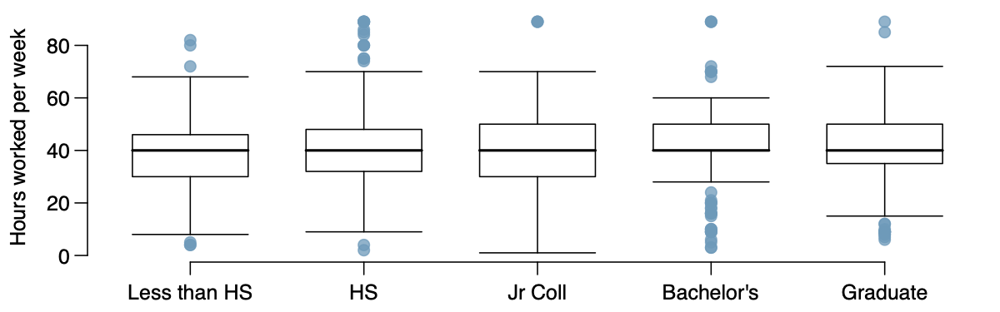

```{r setup, include=FALSE}
knitr::opts_chunk$set(echo = TRUE,
                      warning=FALSE,
                      message=FALSE)
```

# Getting Started

You can find the **hw-02** repo in the [sta210-sp21 organization](https://github.com/sta210-sp2) on GitHub. This repo contains the starter documents and data set needed to complete the lab. 

See the [Lab 01 instructions](https://sta210-sp21.netlify.app/labs/lab-01-ikea.html#getting-started) for more details about cloning the repo, starting a new RStudio project, and configuring git.

## Tips

Here are some tips as you complete the assignment:

- Periodically knit your document and commit changes (the more often the better, for example, once per each new task). You should have at least 3 commit messages by the end of the assignment.
- Push all your changes back to your GitHub repo. The Git pane in RStudio should be empty after you push. You can also check your assignment repo on github.com to make sure it has updated.
- Once you have completed your work, you will submit your assignment in Gradescope. You are welcome to resubmit multiple times until the assignment deadline. We will grade the most recent version of the .pdf file in Gradescope.


## Packages 

We will use the following packages in this assignment: 

```{r}
library(tidyverse)
library(broom)
library(knitr)
#add other packages as needed
```

# Questions

## Part 1: Conceptual questions

**Use the following scenario for Questions 1 - 3.**

*A study compared five different methods for teaching descriptive
statistics. The five methods were traditional lecture and discussion, programmed textbook instruction, programmed text with lectures, computer instruction, and computer instruction with lectures. 45 students were randomly assigned, 9 to each method. After completing the course, students took a 1-hour exam.*

1. What are the hypotheses for evaluating if the average test scores are different for the different teaching methods? Write the hypotheses using mathematical notation.

2. What are the degrees of freedom associated with the F-test for evaluating these hypotheses?

3. Suppose the p-value for this test is 0.0168. What is the conclusion? You can use a significance level of $\alpha = 0.05$ to make your conclusion.
    
**Use the following scenario for Questions 4 - 6.**

*The General Social Survey collects data on demographics, education, and work, among many other characteristics of US residents. Using ANOVA, we can consider 
educational attainment levels for all 1,172 respondents at once. Below are the 
distributions of hours worked by educational attainment and relevant summary 
statistics that will be helpful in carrying out this analysis.*

|  | Less than High School | High School | Jr. College | Bachelor's | Graduate | Total |
|----------------------------|-----------------------|-------------|-------------|------------|----------|-------|
| Mean | 38.67 | 39.6 | 41.39 | 42.55 | 40.85 | 40.45 |
| Standard deviation | 15.81 | 14.97 | 18.1 | 13.62 | 15.51 | 15.17 |
| n | 121 | 546 | 97 | 253 | 155 | 1172 |


```{r echo = F, fig.align = "center"}

```


We wish to test the following hypotheses: 

$$\begin{align} &H_0: \mu_{LHS} = \mu_{HS} = \mu_{JC} = \mu_{B} = \mu_{G} \\
    &H_a: \text{ at least one }\mu_i \text{ is not equal to the others} \end{align}$$


4. Part of the ANOVA table associated with this test is shown below. Use the information above to fill in the missing values, labeled A - H. Show how you calculate each value. If there is no value for that cell, report "NA". 

    
|  | Df | Sum Sq | Mean Sq | F-Stat | Pr(F > F-Stat) |
|-----------|:--:|:------:|:-------:|:------:|:--------------:|
| degree | A | B | 501.54 | C | 0.0682 |
| Residuals | D | 267382 | E | F |  |
| Total | G | H |  |  |  |
    


5. Check the conditions for this test. For each condition, state whether it is satisfied, not satisfied, or can't be assessed with the information provided. Briefly explain your response.

6. State the conclusion of the test in the context of the data. You can use a significance level of $\alpha = 0.05$ to make your conclusion. 

**Use the following scenario and data for questions 7 - 10.**

The Child Health and Development Studies investigate a range of topics. One study considered all pregnancies between 1960 and 1967 among women in the Kaiser Foundation Health Plan in the San Francisco East Bay area. The data set is in the file `babies.csv` and includes the following variables:

- `case` - id number
- `bwt` - birthweight, in ounces
- `gestation` - length of gestation, in days
- `parity` - binary indicator for a first pregnancy (0=first pregnancy)
- `age` - mother's age in years
- `height` - mother's height in inches
- `weight` - mother's weight in pounds
- `smoke` - binary indicator for whether the mother smokes

In order to understand the factors that are related to the birth weight of babies, we want to fit a model predicting the average birth weight of babies based on all of the variables included in the data set. 

1. Write the equation of the statistical model. Then fit the linear model and display the results using 3 digits. 

2. Interpret the slopes of `parity` and `age` in the context of the data.

3. Below is a model predicting the average birth weight based on `parity`. 
```{r echo = F}
babies <- read_csv("data/babies.csv")
lm(bwt ~ parity, data = babies) %>%
  tidy() %>%
  kable(digits = 3, caption = "Regression model to predict birth weight")
```

The coefficient for `parity` is different than in the linear model in Question 7. Briefly explain why there might be a difference. 

4. Use the model from Question 7 to calculate the residual for the first observation in the data set.


# Submission

Knit, commit, and push your final changes to your GitHub repo. Then, submit the PDF on [Gradescope](http://www.gradescope.com). See [Lab 01](https://sta210-sp21.netlify.app/labs/lab-01-ikea.html#submission) for more detailed submission instructions. 


# Grading

| **Total** | **50** |
|-------------------------------------------------------------|:--:|
| Conceptual questions | 45 |
| Document neatly formatted with clear question headers| 3 	|
| At least 3 informative commit messages 	| 2 	|

<br><br>

<hr> 

*Acknowledgments: The questions for this assignment were adapted from OpenIntro Statistics.*
