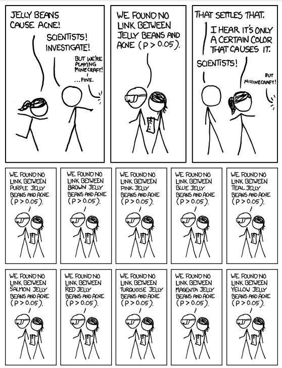
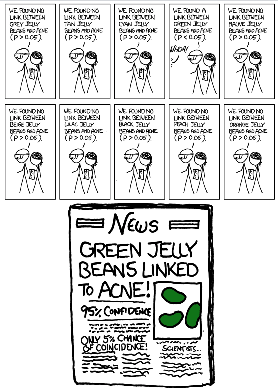

```{r child = "setup.Rmd"}
```

class: middle, center

## [Click here for PDF of slides](09-multiple-comparisons.pdf)

```{r echo = F}
library(tidyverse)
library(knitr)
library(broom)
library(kableExtra)
```

```{r}
aldrin <- read_csv("data/aldrin.csv")
```

---

## Topics 

- Next steps after ANOVA

- Individual vs. family-wise Type I error

- Multiple comparisons using Bonferroni correction 
---

## Aldrin in the Wolf River

```{r echo = F, fig.align = "center", out.width = "40%"}
knitr::include_graphics("img/07/wolf.png")
```

- The Wolf River in Tennessee flows past an abandoned site once used by the pesticide industry for dumping wastes, including chlordane (pesticide), aldrin, and dieldrin (both insecticides).

- These highly toxic organic compounds can cause various cancers and birth defects.


---


## Aldrin in the Wolf River

- The standard methods to test whether these substances are present in a river is to take samples at six-tenths depth. 

<br>


- These compounds are denser than water and their molecules tend to stick to particles of sediment, they are more likely to be found in higher concentrations near the bottom than near mid-depth.

---

class: middle

## Is there a difference between the mean aldrin concentrations among the three depth levels?


---

## ANOVA

```{r}
aldrin_model <- lm(aldrin ~ depth, data = aldrin)
aldrin_anova <- aov(aldrin_model)
aldrin_anova %>%
  tidy() %>%
  kable(format = "html", digits = 3)
```

<br> 

.eq[
$$
\begin{aligned}
&H_0: \mu_1 = \mu_2 = \mu_3\\
&H_a: \text{At least one depth level has }\mu_i \text{ that is not equal to the others}
\end{aligned}
$$
]

---

## ANOVA

```{r}
aldrin_anova %>%
  tidy() %>%
  kable(format = "html", digits = 3) %>%
  column_spec(6, background = "#dce5b2")
```


The p-value is very small $(\approx 0)$, so we reject $H_0$. The data provide sufficient evidence that at least one depth level has a mean aldrin concentration that differs from the others.

---

class: middle

We know at least one depth level has a mean aldrin concentration that differs from the others. 

The next question we want to answer in our analysis is .vocab[*which one*]?

---

 
##  Difference in means

We can use confident intervals to estimate the difference between the means, $\mu_i-\mu_j$ for each pair of groups

.alert[
$$(\bar{y}_i-\bar{y}_j) \pm t^* \times MS_{Within}\sqrt{\frac{1}{n_i}+\frac{1}{n_j}}$$

where the critical value $t^*$ is calculated from a $t$ distribution with $n-K$ degrees of freedom. 
]

If we have $K$ groups, we will make ${K \choose 2} = K(K-1)/2$ such comparisons


---

## Comparisions for Aldrin data set

There are 3 depth levels in our data, so we can make ${3 \choose 2} = 3(3-1)/2 = 3$ comparisons

$$\small{(\bar{y}_{middepth}-\bar{y}_{bottom}) \pm t^* \times MS_{Within}\sqrt{\frac{1}{n_{middepth}}+\frac{1}{n_{bottom}}}}$$
$$\small{(\bar{y}_{surface}-\bar{y}_{bottom}) \pm t^* \times MS_{Within}\sqrt{\frac{1}{n_{surface}}+\frac{1}{n_{bottom}}}}$$
$$\small{(\bar{y}_{surface}-\bar{y}_{middepth}) \pm t^* \times MS_{Within}\sqrt{\frac{1}{n_{surface}}+\frac{1}{n_{middepth}}}}$$
---

## Individual vs. Family-wise Type I Error

.vocab[Type I error]: Incorrectly reject $H_0$. 

- In our example, incorrectly reject the null hypothesis that mean aldrin concentration levels are equal
- Based on our confidence interval, we incorrectly conclude there is a difference in the mean aldrin concentration for the two groups

--

.vocab[Individual Type I error]: incorrectly reject $H_0$ for **one specific** comparison of group means

--

.vocab[Family-wise Type I error]: Incorrectly reject $H_0$ for **at least one** comparison of group means

---

##  Multiple Comparisons

- The probability of making an individual Type I error is $\color{#87037B}{\alpha = 1 - C}$, where $C$ is the confidence level 

- Even if the probability of making an individual Type I error is low, the probability of making a family-wise Type I error becomes much larger when we make multiple comparisons

---

## xkcd "Significant" 

.pull-left[
```{r echo = F, out.width = "75%"}

```

]

--

.pull-right[
```{r echo = F, out.width = "75%"}

```

]
.midi[source:https://xkcd.com/882/]

---

## Adjusting for multiple comparisons 

.alert[
$$(\bar{y}_i-\bar{y}_j) \pm t^* \times MS_{Within}\sqrt{\frac{1}{n_i}+\frac{1}{n_j}}$$

where the critical value $t^*$ is calculated from a $t$ distribution with $n-K$ degrees of freedom. 
]

- When we make multiple comparisons, we will select the critical value $t^*$ to control for the probability of making a  **family-wise Type I error**


---

##  Bonferroni correction

.vocab[Goal: ] Choose the critical value $t^*$ such that the probability of making a .vocab[family-wise Type I error is ] $\color{#87037B}{\alpha}$.

To do so, we will choose $t^*$ such that the probability of making an .vocab[individual Type I error is ] $\color{#87037B}{\frac{\alpha}{m}}$, where $m$ is the number of comparisons 

In other words, we will find $t^*$ that corresponds to a confidence level of $1 - \alpha/m$. 


---

## Comparisons for the Aldrin data set

We want the probability of making a family-wise Type I error to be $\alpha = 0.05$. 

--


We are making 3 comparisons. Therefore, we want probability of making an individual Type I error to be $\alpha / m = 0.05 / 3$. 

--

.alert[
We calculate each confidence interval using the critical value $t*$ that corresponds to a confidence level of $C = 1 - 0.05/3 \approx 0.9833$ in the $t$ distribution with $30 - 3 = 27$ degrees of freedom. 
]


---

## Pairwise comparisions in R

```{r echo = T}
library(pairwiseCI)
pairwiseCI(aldrin ~ depth, data = aldrin, 
           conf.level = 1- 0.05/3, var.equal = TRUE) %>%
  kable(digits = 3)
```

---

## Comparing Aldrin concentrations

```{r}
pairwiseCI(aldrin ~ depth, data = aldrin, 
           conf.level = 1- 0.05/3, var.equal = TRUE) %>%
  kable(digits = 3)
```


Based on this, we see there is a statistically significant difference between the mean aldrin concentration at the surface and at the bottom. 
---


## Recap 

- Next steps after ANOVA

- Individual vs. family-wise Type I error

- Multiple comparisons using Bonferroni correction 